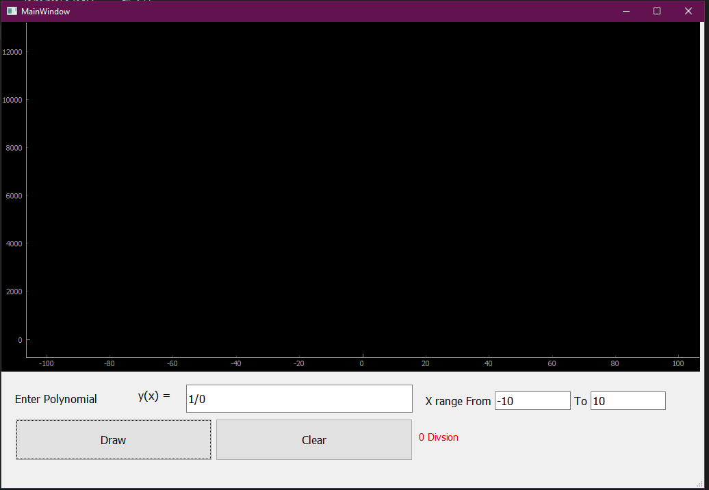
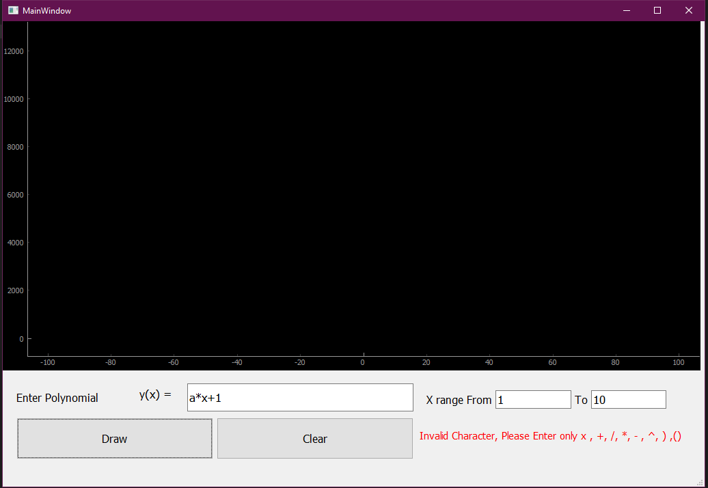

# Function plotter GUI using pyqt
## Screen Shots:
### drawing :   ``` x + 5 ```


### drawing:  ``` X^2 + 10 ```


### drawing: ``` X^3+5*x+1 ```


### drawing  ```(x+1)*(x+25) ```


## Input Validation :
### zero division


### function wrong format : ``` x^3 + 5x + 1  ```


### Unbalanced bracket :


### Invalid character :


### Capital case handling:


### No input at all:


### No range values:


### Entering characters in range input:

